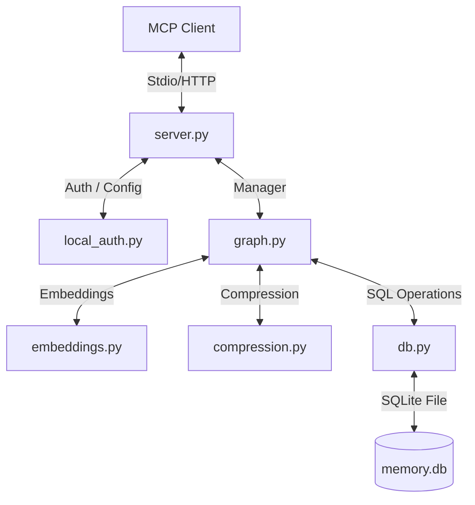

# Project Index: `server-memory`

This document provides a structured map of the `server-memory` codebase, listing key entry points, components, configurations, workflows, and tests. It serves as a guide for future developers and AI coding agents.

---

## 1. Project Overview

`server-memory` is a local-first Model Context Protocol (MCP) memory server backed by SQLite. It manages a persistent knowledge graph composed of entities, observations, relations, and tags, alongside an activity log timeline. It supports:
- **Lexical & Semantic Retrieval**: Balanced FTS5 search and optional embedding-assisted similarity retrieval.
- **Compression**: Token-aware output formatting to stay within context budgets.
- **Multi-Client Concurrency**: A shared HTTP daemon mode alongside a stdio proxy bridge to prevent SQLite database lock contention.
- **Context Namespacing**: Automatic database namespacing based on local workspace roots.

---

## 2. Major Components & Architecture

The project is structured into three layers:
1. **Database Layer** ([db.py](src/server_memory/db.py)): Handles the SQLite schema, FTS5 virtual tables, WAL configuration, transactional retries, and automatic migrations.
2. **Graph Business Logic Layer** ([graph.py](src/server_memory/graph.py)): Implements CRUD operations, staged retrieval, scoring/ranking heuristics, deduplication, and conflict/staleness tagging.
3. **MCP Interface Layer** ([server.py](src/server_memory/server.py)): Wraps the business logic in the `FastMCP` framework, defining tool registrations and local bearer authentication.



---

## 3. Confirmed Entry Points

- **Stdio MCP Server**: Run via [__main__.py](src/server_memory/__main__.py) by running `python -m server_memory` or using the global `server-memory` CLI script.
- **Shared HTTP Daemon**: Run via [serve.py](serve.py) to host a shared server instance.
- **Stdio-to-HTTP Proxy**: Run via [stdio_proxy.py](stdio_proxy.py) to connect stdio-only clients to the shared daemon.
- **Benchmark Suite**: Run via [run_benchmark.py](benchmark/run_benchmark.py) to assess task performance with and without memory.

---

## 4. Key Commands & Workflows

### Setup & Installation
```bash
python3 -m venv .venv
source .venv/bin/activate
pip install --upgrade pip
pip install -e '.[dev,embeddings,desktop-proxy,benchmark]'
```

### Running Server Actions
- **Launch Stdio Server**:
  ```bash
  python -m server_memory
  ```
- **Launch Shared Daemon**:
  ```bash
  python serve.py --host 127.0.0.1 --port 8765 --transport streamable-http
  ```
- **Launch Stdio Proxy Bridge**:
  ```bash
  python stdio_proxy.py --url http://127.0.0.1:8765/mcp
  ```

### Running Tests and Lints
- **Ruff Check**: `python -m ruff check .`
- **Pytest**: `python -m pytest`
- **Build Package**: `python -m build`

---

## 5. Configuration & Storage Locations

All configurations map from environment variables via [MemoryConfig](src/server_memory/config.py#L22):
- `MEMORY_DB_PATH`: SQLite database file path. Defaults to a platform-native data directory namespaced under workspace roots (see [paths.py](src/server_memory/paths.py)).
- `MEMORY_COMPRESSION_LEVEL`: Int (`0` to `4`, where `4` is `AUTO`).
- `MEMORY_TOKEN_BUDGET`: Default token budget for query outputs (defaults to `2000`).
- `MEMORY_EMBEDDING_ENABLED`: Set to `true`/`false` to toggle semantic search (defaults to `true`).
- `MEMORY_HTTP_AUTH_ENABLED`: Require local bearer authorization for the shared HTTP daemon (defaults to `true`).

---

## 6. Testing & Validation

Tests reside in the `tests/` directory and use `pytest`:
- [conftest.py](tests/conftest.py): Defines shared fixtures [db](tests/conftest.py#L17) and [graph](tests/conftest.py#L27).
- [test_db.py](tests/test_db.py): Validates schema, WAL mode, FTS triggers, and migrations.
- [test_graph.py](tests/test_graph.py): Validates database transactional locks, soft deletes, and entity merging.
- [test_compression.py](tests/test_compression.py): Validates token-aware graph compression logic.
- [test_search.py](tests/test_search.py): Validates FTS5 search and fuzzy fallbacks.
- [test_hybrid_search.py](tests/test_hybrid_search.py): Validates semantic similarity combined with lexical matches.
- [test_tools.py](tests/test_tools.py): Validates activity logs, memory context matching (with exact prioritization, pinned weights, and conflict/staleness markers), and backup routines.

---

## 7. Documentation Map

- [README.md](README.md): Primary user guide, options, architecture overview, and environment variables.
- [CONTRIBUTING.md](CONTRIBUTING.md): Instructions for developer setup, PR validation, and security constraints.
- [SECURITY.md](SECURITY.md): Security policy, local data warning guidelines, and disclosure procedures.
- [RELEASING.md](RELEASING.md): Checklists for preparing a public release.
- [server_memory_analysis.md](server_memory_analysis.md): Strategic findings from benchmarks and recommendations.
- [security_best_practices_report.md](security_best_practices_report.md): Case study reporting a previously resolved security configuration issue.
- **Design Spec**: [tooling-design.md](docs/superpowers/specs/2026-03-26-server-memory-retrieval-and-tooling-design.md)
- **Implementation Plan**: [tooling-plan.md](docs/superpowers/plans/2026-03-26-server-memory-retrieval-and-tooling-plan.md)

---

## 8. Structured File Index

### Local Configuration & Workspace Settings
- [pyproject.toml](pyproject.toml): Package metadata, dependencies, scripts, and build/lint settings.
- [.gitignore](.gitignore): Git ignore rules for cached, local, and built assets.
- [.env.example](.env.example): Reference configuration template file.
- [.claude/settings.local.json](.claude/settings.local.json): Local command permissions for the workspace.
- [.claude/commands](.claude/commands): Developer shortcut scripts metadata file (empty).
- [.claude/agents](.claude/agents): Custom agent configurations metadata file (empty).

### Core Package: `src/server_memory/`
- [src/server_memory/__init__.py](src/server_memory/__init__.py): Main core package initialization.
- [src/server_memory/__main__.py](src/server_memory/__main__.py): Entry point for the stdio MCP server.
- [src/server_memory/config.py](src/server_memory/config.py): Configuration parsing ([MemoryConfig](src/server_memory/config.py#L22) and [CompressionLevel](src/server_memory/config.py#L13)).
- [src/server_memory/db.py](src/server_memory/db.py): SQLite layer ([Database](src/server_memory/db.py#L196)), schemas, FTS triggers, and transaction controls.
- [src/server_memory/models.py](src/server_memory/models.py): Schema dataclasses ([Entity](src/server_memory/models.py#L11), [Observation](src/server_memory/models.py#L59), [Relation](src/server_memory/models.py#L77), [Tag](src/server_memory/models.py#L102), [ActivityEntry](src/server_memory/models.py#L113), [KnowledgeGraph](src/server_memory/models.py#L133)).
- [src/server_memory/graph.py](src/server_memory/graph.py): Knowledge graph business logic manager (`KnowledgeGraphManager`), context query logic, and ranking.
- [src/server_memory/embeddings.py](src/server_memory/embeddings.py): Optional lazy-loaded local embedding engine ([EmbeddingEngine](src/server_memory/embeddings.py#L28)).
- [src/server_memory/compression.py](src/server_memory/compression.py): Graph compression and token budgeting routines.
- [src/server_memory/server.py](src/server_memory/server.py): FastMCP wrapper definition and authorization check helpers.
- [src/server_memory/local_auth.py](src/server_memory/local_auth.py): Bearer token file operations and verifier ([LocalTokenVerifier](src/server_memory/local_auth.py#L137)).
- [src/server_memory/paths.py](src/server_memory/paths.py): Native user directory layout and namespaced DB location logic.

### Development Shim
- [server_memory/__init__.py](server_memory/__init__.py): Shim directory import setup.
- [server_memory/__main__.py](server_memory/__main__.py): Shim execution forwarder enabling `python -m server_memory`.

### Test Suite: `tests/`
- [tests/__init__.py](tests/__init__.py): Test folder initialization.
- [tests/conftest.py](tests/conftest.py): Shared fixtures [db](tests/conftest.py#L17) and [graph](tests/conftest.py#L27).
- [tests/test_config.py](tests/test_config.py): Tests config validation.
- [tests/test_db.py](tests/test_db.py): Tests SQLite schema, WAL, and triggers.
- [tests/test_embeddings.py](tests/test_embeddings.py): Tests mock embedding engine.
- [tests/test_graph.py](tests/test_graph.py): Tests graph CRUD, soft delete, and merge.
- [tests/test_paths.py](tests/test_paths.py): Tests AppPaths and database paths resolution.
- [tests/test_compression.py](tests/test_compression.py): Tests output compression.
- [tests/test_search.py](tests/test_search.py): Tests FTS5 search and fallback.
- [tests/test_hybrid_search.py](tests/test_hybrid_search.py): Tests semantic search balance.
- [tests/test_tools.py](tests/test_tools.py): Tests context query tools and backups.
- [tests/test_local_auth.py](tests/test_local_auth.py): Tests local bearer token checks.
- [tests/test_stdio_proxy.py](tests/test_stdio_proxy.py): Tests stdio proxy forwarders.
- [tests/test_benchmark.py](tests/test_benchmark.py): Tests benchmark result parsers.
- [tests/memory_context_benchmarks.py](tests/memory_context_benchmarks.py): Retrieval scenario definitions used in testing.
- [tests/test_memory_context_benchmarks.py](tests/test_memory_context_benchmarks.py): Tests running memory context scenario benchmarks.

### Running Tools & Utilities
- [serve.py](serve.py): Daemon boot wrapper.
- [stdio_proxy.py](stdio_proxy.py): Stdio-to-HTTP proxy bridge for client transport.
- [benchmark.py](benchmark.py): Retrieval recall benchmark definitions and fixtures.
- [benchmark/run_benchmark.py](benchmark/run_benchmark.py): Agent benchmark harness.
- [benchmark/tasks.yaml](benchmark/tasks.yaml): Task prompt definitions for agent benchmark evaluations.

### GitHub Templates & Workflows
- [.github/workflows/ci.yml](.github/workflows/ci.yml): CI validation workflow.
- [.github/pull_request_template.md](.github/pull_request_template.md): PR description template.
- [.github/ISSUE_TEMPLATE/bug_report.yml](.github/ISSUE_TEMPLATE/bug_report.yml): Bug template config.
- [.github/ISSUE_TEMPLATE/feature_request.yml](.github/ISSUE_TEMPLATE/feature_request.yml): Feature request config.

### Agent Specific Documentation & Instructions
- [PROJECT_INDEX.md](PROJECT_INDEX.md): This file itself.
- [RELEASE_SANITIZATION_FINDINGS.md](RELEASE_SANITIZATION_FINDINGS.md): Release-preparation sanitization report.
- [.github/instructions/caveman-incident-remediation.instructions.md](.github/instructions/caveman-incident-remediation.instructions.md): Context on security defaults.
- [.github/instructions/python-mcp-server.instructions.md](.github/instructions/python-mcp-server.instructions.md): FastMCP SDK developer guidelines.
- [.github/instructions/server-memory-evidence-bound-maintenance.instructions.md](.github/instructions/server-memory-evidence-bound-maintenance.instructions.md): Repository maintenance guidelines.

### Grouped Entries for Repetitive Content
- **Ignored Caches & Virtualenvs**:
  - `.venv/`: Project virtual environment.
  - `.pytest_cache/`: Temporary pytest cache.
  - `.ruff_cache/`: Temporary Ruff linter cache.
  - `**/__pycache__/`: Compiled Python bytecodes.
- **Build Output**:
  - `dist/`: Build wheel and source package outputs.
  - `src/server_memory.egg-info/`: Generated build configuration files.
- **Local SQLite Data**:
  - `memory.db` / `memory.db-wal` / `memory.db-shm`: SQLite database workspace logs.
- **Historical Benchmark JSONs**:
  - `benchmark/results/`: Directory for benchmark outputs (contains `.gitkeep` and local JSON runs).
- **Backup Files**:
  - `serve.py.bak.*`, `tests/conftest.py.bak.*`: Local backup files.
